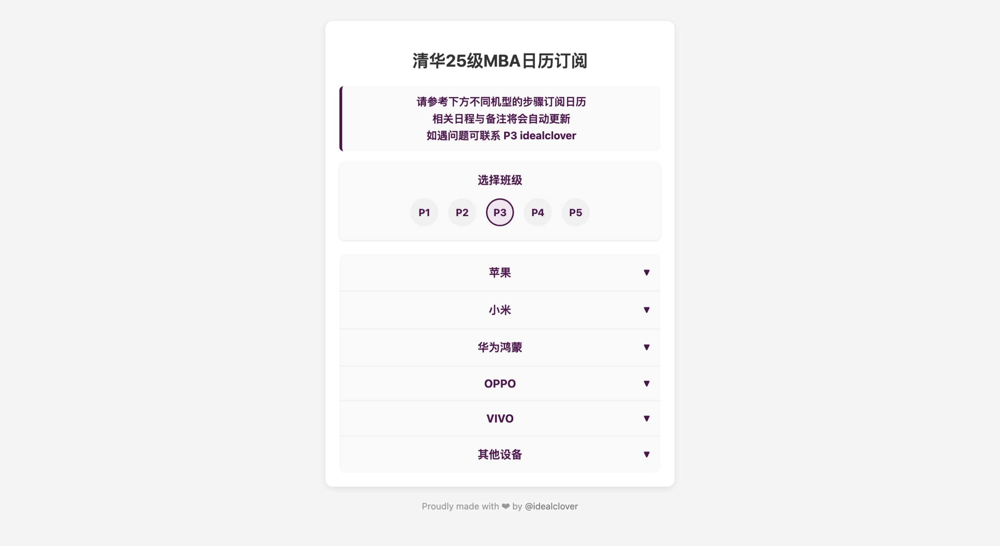

# Calender-Subscribe

> 都上清华了，还是逃不了做课表的命运 🥺

将 CSV 格式的日程安排转换为 ICS 日历文件&上传到 CalDAV 服务器并提供订阅服务的工具。

支持苹果、小米、华为、OPPO、VIVO 等手机系统日历应用订阅。

目前供 2025 级清华大学 MBA 预录取新生使用。



## ✨ 功能特性

- 📅 CSV 转 ICS 转换：将 CSV 格式的课程表自动转换为标准的 ICS 日历文件
- 🔐 ICS 文件&CalDAV 支持：支持通过订阅文件/CalDAV 方式订阅
- 🌐 在线订阅服务：提供 Web 界面，支持各种品牌手机的日历应用订阅
- 📱 多平台兼容：支持 iOS、安卓各手机品牌系统日历订阅

## 📄 项目结构

```
Calender-Subscribe/
├── README.md              # 项目说明文档
├── index.html             # Web 订阅界面
├── resources/             # 资源文件夹
│   └── 2025p3.csv        # 示例课程表 CSV 文件
├── results/               # 生成的 ICS 文件输出目录
│   └── .gitkeep
└── scripts/               # 脚本文件夹
    ├── config_sample.py   # 配置文件模板
    ├── main.py           # 主程序脚本
    └── requirements.txt   # Python 依赖包列表
```

## 📦 快速开始

### 1. 环境准备

确保您的系统已安装 Python 3.6+，然后安装依赖包：

```
cd scripts
pip install -r requirements.txt
```

### 2. 配置设置

复制配置文件模板并填入您的配置信息：

```
cp config_sample.py config.py
```

编辑 config.py 文件，填入以下配置：

```
# 腾讯云 COS 配置
COS_SECRET_ID = "your_secret_id"        # 腾讯云 SecretId
COS_SECRET_KEY = "your_secret_key"      # 腾讯云 SecretKey
COS_REGION = "ap-beijing"               # 地域，如 ap-beijing、ap-guangzhou 等
COS_BUCKET = "your_bucket_name"         # 存储桶名称
COS_PATH = "calendar/"                  # 存储路径

# CDN 配置
CDN_URL = "https://your-cdn-domain.com" # CDN 域名

# CalDAV 配置（可选）
CALDAV_UPLOAD_URL = "https://your-caldav-server.com"
CALDAV_CREDENTIALS = {
    "2025p3.ics": {"username": "your_username", "password": "your_password"},
}
```

### 3. 部署 CalDAV 服务器

由于一些品牌的手机日历应用不支持 Ics 文件直接订阅，所以需要部署一个 CalDAV 服务器。

> 参考 [radicale](https://radicale.org/master.html)

### 3. 准备 CSV 文件

将您的课程表 CSV 文件放入 resources/ 目录。CSV 文件格式要求：

| 标题                        | 日期       | 开始时间 | 结束时间 | 备注     |
| --------------------------- | ---------- | -------- | -------- | -------- |
| 数据、模型与决策@建德楼 202 | 2025.05.24 | 08:50    | 12:10    | 课程导论 |

### 4. 运行转换

执行主程序进行转换和上传：

```
cd scripts
python main.py
```

程序将自动：

- 读取 resources/ 目录中的所有 CSV 文件
- 转换为 ICS 格式并保存到 results/ 目录
- 上传到腾讯云 COS
- 刷新 CDN 缓存
- 可选：上传到 CalDAV 服务器

### 5. 网站配置修改

修改 index.html 中的配置：

```
CDN_BASE_URL: "",
CALDAV_SERVER: "",
```

## 📃 许可证

MIT LICENSE, have fun coding!
